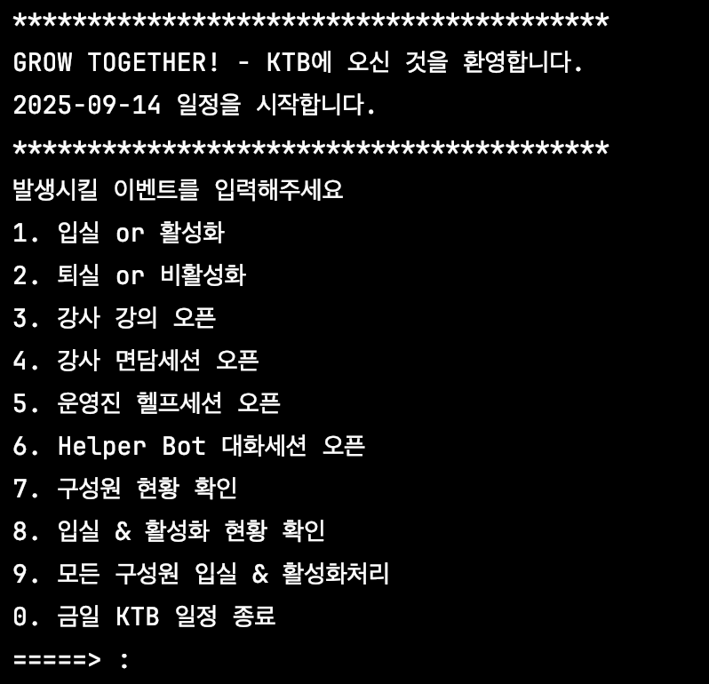

# Simple Java CLI for KTB
개요: Java의 객체지향적 설계, 멀티스레딩을 실습하는 프로젝트 입니다.  
사용: jdk17, IntelliJ IDEA  

**목표**
1. 프로그램 클래스 다이어그램 작성 (2차 상속을 최대 1개 이상 포함)
2. 간단한 스레드 구현
3. 스레드 간 상호작용 할 수 있는 기능 구현

****

**사용방법 및 실행예시**  

해당 프로젝트를 빌드 후 실행하면 아래와 같은 아스키아트 배너가 나옵니다.  

그리고 하단에 다음과 같이 이용할 수 있는 옵션이 나타납니다.  

## 1. 입실 or 활성화
강사, 운영진, 교육생의 경우 입실, Bot의 경우 활성화 처리를 합니다.  
사전에 파일로 구성된 (/src/resources/members.txt) 명단에 포함되고 입실하지 않은 상태에 대해서만 처리가 가능하며, 
명단에 포함되지 않은 인원에 대한 입력은 예외처리가 되어있습니다.  
내부적으로 관리하는 저장소에 입실 or 활성화 처리된 구성원의 정보가 등록됩니다.

## 2. 퇴실 or 비활성화
강사, 운영진, 교육생의 경우 입실, Bot의 경우 비활성화 처리를 합니다.  
사전에 파일로 구성된 (/src/resources/members.txt) 명단에 포함되고 입실한 상태에 대해서만 처리가 가능하며, 
명단에 포함되지 않은 인원에 대한 입력은 예외처리가 되어있습니다.  
내부적으로 관리하는 저장소에서 입실 or 활성화 처리되어 있던 구성원의 정보를 삭제합니다.

## 3. 강사 강의 오픈
강사가 강의를 오픈하는 상황을 가정합니다. 강사는 자신의 교육트랙에 참여 중인 교육생에 대해서만 강의가 가능하며 
강의에 참여한 교육생들은 강의에서 제공하는 지식 k 만큼 자신의 지식이 상승합니다.  
해당 과정은 싱글스레드로 순차처리하도록 설계되어 있습니다.

## 4. 강사 면담세션 오픈
강사가 면담세션을 오픈하는 상황을 가정합니다. 강사는 동시에 1명의 학생만 면담할 수 있습니다. 
면담 세션을 여는 강사를 지정하면, 참여트랙에 관계없이 모든 교육생들은 1명의 강사를 두고 면담을 위해 경쟁하게 됩니다.  
해당 과정은 멀티스레드로 동작하도록 설계되어 있으며, Lock 획득을 시도하는 시간제한이 설정되어 있습니다. 
주어진 시간동안 Lock을 획득하지 못하는 경우 교육생은 면담을 포기하고 자신의 자리로 돌아갑니다.  
면담에 참여한 교육생은 스트레스 하락의 효과를 얻습니다.

## 5. 운영진 헬프세션 오픈
운영진이 헬프세션을 오픈하는 상황을 가정합니다. 운영진은 동시에 1명의 학생에게만 도움을 제공할 수 있습니다.  
헬프 세션을 여는 운영진을 지정하면, 참여트랙에 관계없이 모든 교육생들은 1명의 운영진을 두고 도움을 받기 위해 경쟁합니다.  
해당 과정은 멀티스레드로 동작하도록 설계되어 있으며, Lock 획들을 시도하는 시간제한이 존재하지 않습니다.  
즉, 교육생들은 운영진의 도움을 통해 문제를 반드시 해결해야 하기 때문에 시간이 오래 걸려도 기다려서 도움을 받습니다.  
헬프세션에 참여한 교육생은 이슈 하락의 효과를 얻습니다.

## 6. Helper Bot 대화세션 오픈
Helper Bot 이 대화세션을 오픈하는 상황을 가정합니다. Bot은 동시에 여러 학생에게 도움을 제공할 수 있습니다. 
대화세션을 오픈할 Bot을 지정하면, 참여트랙에 관계없이 모든 교육생들은 1개의 Bot에게 동시에 대화세션을 요청합니다. 
해당 과정은 멀티스레드로 설계되어 있으며, Lock 매커니즘의 사용없이 모든 스레드가 동시에 접근합니다. 
Bot은 사람이 아니기 때문에 동시에 여러 교육생들과 1:1 대화를 수행할 수 있습니다. 
해당 세션에서는 내부적으로 몇 개의 대화가 진행되었는 지를 내부적으로 유지합니다.

## 7. 구성원 현황 확인
"/src/resources/members.txt" 파일에 기재된 모든 구성원의 정보를 로딩합니다. 
해당 파일에 명세한 강사, 운영진, Bot, 교육생의 명단을 확인할 수 있습니다.

## 8. 입실 & 활성화 현황 확인
"/src/resources/members.txt" 파일에 기재된 구성원 중 현재 교육장에 입실한 상태인 구성원을 보여줍니다. 
현재 입장한 상태의 강사, 운영진, Bot, 교육생의 명단을 확인할 수 있습니다.

## 9. 모든 구성원 입실 & 활성화 처리
"/src/resources/members.txt" 파일에 명세한 모든 구성원을 한번에 입실 처리합니다. 
해당 기능을 호출하는 시점에 이미 입실한 구성원이 존재하는 경우, 해당 구성원을 제외하고 입실처리가 진행됩니다. 
3 ~ 6에 대한 시뮬레이션을 빠르고 수월하게 하기 위해 추가한 유틸리티성 기능입니다.

## 0. 금일 KTB 일정 종료
해당일자 교육일정을 종료하고, 프로그램을 종료합니다.